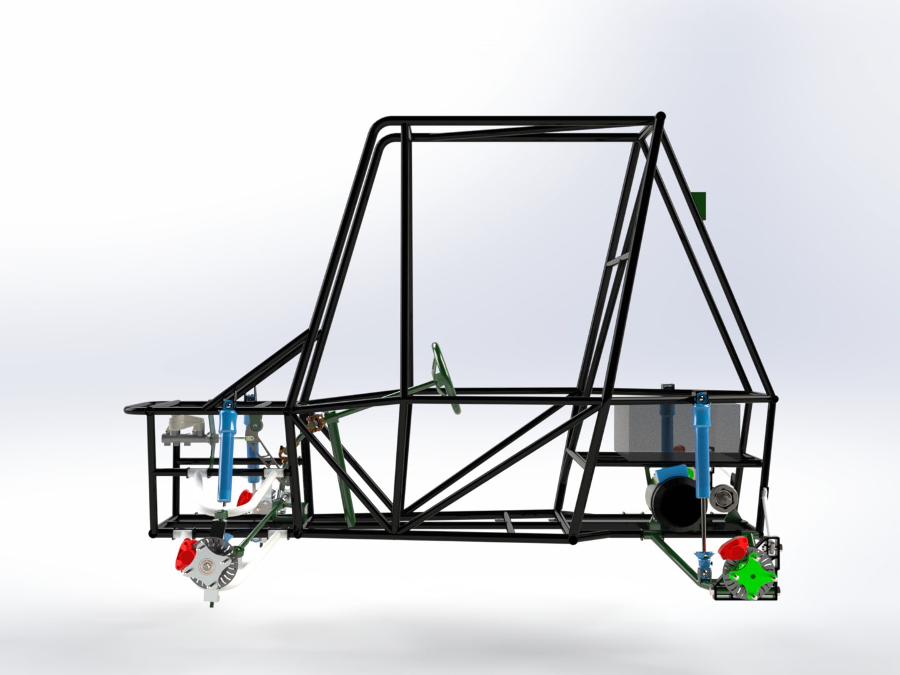
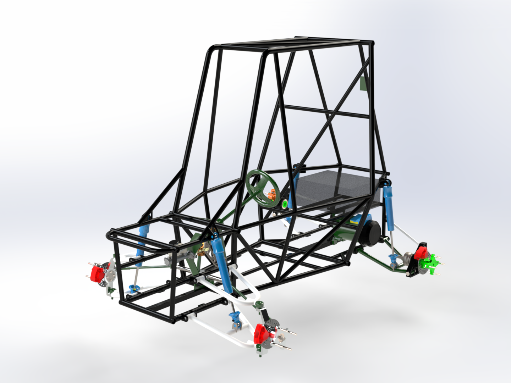
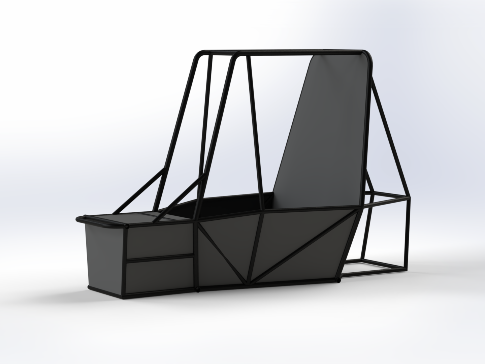

# rollcage-design

# 🛠️ BAJA SAEINDIA 2025 Roll Cage Design – Team Moksha

This repository documents the complete roll cage design for Team Moksha's BAJA SAEINDIA 2025 All-Terrain Vehicle. The roll cage is engineered in accordance with the BAJA SAEINDIA 2025 rulebook and validated using CAE tools to ensure driver safety and structural reliability under extreme racing conditions.

---

## 🧱 Roll Cage Overview

- **Material**: AISI 4130 Chromoly Steel  
- **Primary Members**: OD = 1.125″, Thickness = 0.125″  
- **Secondary Members**: OD = 1″, Thickness = 0.065″  
- **Meshing**: 3D Tetrahedrons (3 mm)  
- **CAE Tool**: Ansys 2024 R2  

---

## 📐 Design Objectives

- Meet all **BAJA SAEINDIA 2025 Rulebook** specifications.
- Ensure **driver safety**, **structural integrity**, and **weight optimization**.
- Achieve optimal **ergonomics**, **visibility**, and **serviceability**.
- Simulate real-world crash scenarios for **front**, **rear**, **side**, and **rollover** impacts.

---

## 🧪 CAE Validation Summary

| Test Type     | Load (N) | Max Stress (MPa) | Factor of Safety |
|---------------|----------|------------------|------------------|
| Front Impact  | 21000    | 214.67           | 2.14             |
| Rear Impact   | 21000    | 287.58           | 1.60             |
| Side Impact   | 10500    | 267.44           | 1.72             |
| Rollover      | 5250     | 117              | 3.93             |

- **Yield Strength (AISI 4130)**: 460 MPa  
- **Ultimate Strength**: 560 MPa  
- **Young’s Modulus**: 190 GPa  
- **Elongation**: 21.5%

---

## 🧍 Ergonomic Compliance

| Parameter                         | Rulebook Minimum | Designed Value |
|----------------------------------|------------------|----------------|
| Length of LC Member              | ≥ 8″             | 14.17″         |
| Inclination of RRH               | ≤ 20°            | 12°            |
| RRH Width @ 27″ from seat bottom | ≥ 29″            | 30.21″         |
| RRH Width @ 14″ from seat bottom | ≥ 32″            | 36.26″         |
| Driver Helmet Clearance          | ≥ 6″             | 8.96″          |
| SIM Height from Seat Bottom      | 8″ – 14″         | 13.04″         |
| RHO Diagonal Distance from C     | ≤ 3″             | 2.66″          |
| LDB Angle with RRH               | ≥ 20°            | 31.81°         |
| Triangulation of Rear FAB        | ≥ 20°            | 34.77°         |

---

## ⚙️ Vehicle Dynamics

| Parameter         | Value          |
|------------------|----------------|
| Sprung Mass      | 205 kg         |
| Unsprung Mass    | 60 kg          |
| Ground Clearance | 12″            |
| COG Position     | X=1220 mm, Y=0 mm, Z=540 mm |

---

## 📎 Rulebook Reference

Design complies with [BAJA SAEINDIA 2025 Rulebook](./BAJA%20SAEINDIA%20RULEBOOK%202025_Rev00_1720015607.pdf), including structural, ergonomic, and safety constraints.

---

## 🖥️ Software Used

- **CAD**: SolidWorks 2024  
- **CAE**: ANSYS 2024 R2  
- **Documentation**: LaTeX, PowerPoint  
- **Post-processing**: Adobe Illustrator / Photoshop  

---

## 👥 Contributors

- **Goraksh Bendale** – Design Lead, Simulation Engineer  
- **Team Moksha – BAJA SAEINDIA 2025**  

---

## 📌 Future Scope

- Dynamic crash testing (LS-DYNA)
- Composite reinforcement for rear impact region
- Weight optimization using topology analysis
- Modular side impact structures

---

## 📄 License

This project is for educational and competitive purposes under the BAJA SAEINDIA framework. Not licensed for commercial use.
